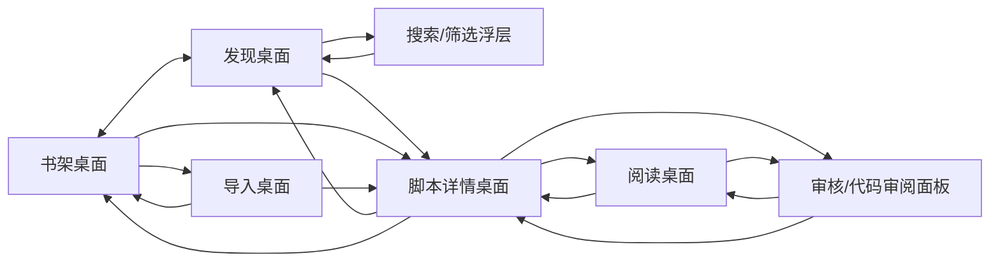

# KMD Reader Android 页面架构

> 项目阶段：第二阶段页面流转设计
> 文档状态：草案
> 最近更新：2026-05-26

## 1. 目标

本页面架构用于支撑第二阶段课程提交和后续 Compose UI 搭建。当前阶段优先完成：

- 明确 MVP 页面范围。
- 明确“活动桌面式导航”的页面模型。
- 明确页面跳转图。
- 明确 KMD 不同阅读形态的统一展示方式。
- 明确搜索/筛选和审核体验的位置。
- 为后续 Figma 设计提供页面清单和信息层级。

当前阶段不追求最终视觉风格，先保证页面骨架清晰、可实现、可截图提交。

## 2. 设计原则

KMD Reader Android 不采用传统底部导航。应用采用“活动桌面式导航”：

> 页面永远保持活动桌面式导航，在任何时候左右滑动即切换“桌面”。

`桌面` 是架构和开发文档中的内部术语。用户界面中应优先使用“页面”“标签”“返回”等普通表达，不直接展示“活动桌面”“桌面条带”等概念。

这意味着：

- 首页只有两个主桌面：`书架` 和 `发现`。
- 书架位于发现左侧；开屏默认落在书架还是发现，可以在课程验收后根据使用场景再决定。
- 顶部使用无按钮框的标签页标识当前页面，底部用长分割线和短下划线表达选中态。
- 用户可以左右滑动切换主桌面。
- 从任一桌面进入脚本、导入、阅读或审核时，新页面从右侧长出。
- 用户可以在已经长出的桌面之间左右滑动切换。
- 桌面不会因为用户暂时滑开而立即销毁。
- 当桌面树结构产生冲突，或用户进入另一种使用模式时，系统替换或回收互斥桌面。
- 应用不维护一串越来越长的 Tab，只维护当前活动桌面条带和少量可保留桌面。

示例：

```text
书架 - 发现
书架 - 发现 - 脚本详情
书架 - 发现 - 脚本详情 - 阅读视图
```

当用户显式关闭右侧桌面时，页面条带逐步收回：

```text
书架 - 发现 - 脚本详情 - 阅读视图
书架 - 发现 - 脚本详情
书架 - 发现
```

## 3. MVP 页面范围

第二阶段页面围绕 5 个功能展开：

| 功能 | 相关页面/面板 |
|------|---------------|
| 浏览作品 | 发现桌面、搜索/筛选浮层 |
| 查看详情 | 脚本详情桌面 |
| 阅读 KMD | 阅读桌面 |
| 本地导入 | 书架桌面、导入桌面 |
| 审核体验 | 脚本详情中的审核入口、阅读桌面中的代码审阅面板 |

暂不进入页面主流程：

- 登录/注册。
- 独立审核 Tab。
- 完整评论区。
- 关注/私信。
- 推荐算法配置。
- 完整 KMD 编辑器。
- 真实社区上传。

## 4. 桌面结构

### 4.1 主桌面

应用常驻两个主桌面：

| 桌面 | 作用 |
|------|------|
| 书架 | 用户已拥有或已留下痕迹的 KMD：本地导入、最近阅读、收藏、离线缓存、草稿、设置/关于入口 |
| 发现 | 社区作品浏览、预览、搜索和筛选 |

顶部导航只显示这两个主桌面。用户可以点击顶部标签，也可以左右滑动切换。

实现备注：当前原型代码里可能仍使用 `Mine` / `Browse` 作为内部枚举名；产品文案、设计稿和后续重命名应以 `书架` / `发现` 为准。

### 4.2 临时桌面

临时桌面从当前桌面右侧长出：

| 临时桌面 | 进入方式 | 返回方式 |
|----------|----------|----------|
| 脚本详情 | 点击发现卡片、书架条目、导入结果、最近阅读记录 | 向左/右滑回上一个桌面或返回按钮 |
| 阅读视图 | 从脚本详情点击开始阅读 | 滑回脚本详情 |
| 导入视图 | 从书架桌面点击导入 | 滑回书架桌面 |

临时桌面不是长期 Tab。用户滑动离开时可以保留，用户显式关闭、打开互斥内容或切换使用模式时才回收。

## 5. 桌面生命周期与冲突规则

活动桌面式导航需要区分“切换”和“关闭”：

- **切换**：用户左右滑动到另一个桌面，原桌面保留状态。
- **关闭**：用户返回、关闭右侧桌面，或打开了与当前桌面互斥的新内容。
- **替换**：新内容与已有桌面类型冲突时，系统复用该位置并替换内容。

### 5.1 保留规则

以下状态应在用户切换桌面时保留：

- 发现桌面的滚动位置。
- 搜索/筛选条件。
- 书架桌面的分组、排序和本地列表状态。
- 当前脚本详情的展开区域和选中标签。
- 阅读桌面的播放/阅读进度。
- 审阅面板的展开/收起状态和临时备注。

### 5.2 互斥规则

同类核心内容不共存，避免桌面条带无限增长：

| 桌面/面板 | 规则 |
|-----------|------|
| 脚本详情 | 同一时间只存在一个脚本详情桌面。打开另一个脚本时替换现有详情、阅读和审阅状态。 |
| 阅读桌面 | 同一时间只存在一个阅读桌面，并且必须依附当前脚本详情。切换脚本后销毁旧阅读桌面。 |
| 导入桌面 | 同一时间只存在一个导入流程。导入完成后可以替换为新脚本详情。 |
| 审阅面板 | 依附当前脚本详情或阅读桌面。切换脚本后销毁旧审阅状态。 |
| 搜索/筛选浮层 | 只依附发现桌面。切换到详情或阅读时自动收起，但筛选条件可以保留。 |

### 5.3 模式切换规则

某些操作意味着用户进入新的使用模式，需要回收右侧桌面：

- 从发现桌面打开另一个脚本：替换旧脚本详情、旧阅读桌面和旧审阅面板。
- 从书架桌面导入新脚本并进入详情：替换旧脚本详情。
- 从阅读桌面切换到审阅模式：保留阅读桌面，只呼起审阅面板。
- 从审阅模式返回阅读：收起审阅面板，不销毁阅读桌面。
- 清除筛选条件：只影响发现桌面，不影响已经打开的详情桌面。

### 5.4 顶部导航展示

顶部导航不展示历史栈，只展示当前活动条带：

```text
书架 | 发现 | 脚本详情 | 阅读
```

如果用户打开另一个脚本，条带不会变成：

```text
书架 | 发现 | 脚本 A | 阅读 A | 脚本 B
```

而是替换为：

```text
书架 | 发现 | 脚本 B
```

## 6. 页面跳转图



## 7. 页面说明

### 7.1 书架桌面

页面定位：

用户管理自己手上 KMD 作品的阅读入口。书架不是“个人中心”的换皮，而是读者已经拥有、收藏、导入、缓存或读过的 KMD 作品集合；设置、关于和账号信息只作为书架里的轻量二级入口存在。

核心内容：

- 继续阅读：按最近阅读时间展示作品、进度和上次阅读时间。
- 本地作品：用户导入的 `.kmd`、本地草稿、随包示例。
- 收藏作品：从发现流或详情页收藏的社区作品。
- 离线可读：已缓存 source 的社区作品，明确标注可离线。
- 需联网：只有元数据或收藏记录、没有本地 source 的社区作品，阅读按钮应显示“需连接社区 API”或禁用。
- 导入入口：添加本地 `.kmd` 到书架。
- 管理入口：排序、移除、清理缓存、设置、关于。

第二阶段可简化为：

- 本地导入按钮。
- 最近阅读占位列表。
- 本地/示例作品列表。
- 设置和项目说明入口。

### 7.2 发现桌面

页面定位：

读者默认探索入口，用于浏览社区作品。发现桌面不假设所有 KMD 都是纵向内容，而是按作品阅读形态展示对应预览。

核心内容：

- 作品标题。
- 作者。
- 标签。
- 简短摘要。
- 预计阅读/播放时长。
- 作品形态：滚动阅读、页面阅读、横屏舞台、横屏互动等。
- 预览区域。
- 评论摘要。
- 搜索/筛选入口。

第二阶段可简化为：

- 使用静态 mock 卡片。
- 每张卡片展示作品形态徽标。
- 预览区域用不同宽高比例占位，表现横屏/竖屏差异。

### 7.3 搜索/筛选浮层

页面定位：

搜索/筛选不作为独立桌面，而是发现桌面上的半透明覆盖层。用户打开搜索后，发现桌面直接展示筛选结果。

核心内容：

- 半透明背景。
- 搜索输入框。
- 标签筛选。
- 类型筛选：滚动、页面、横屏舞台、互动。
- 状态筛选：已上架、本地、待审核。
- 结果数量。

交互规则：

- 打开搜索时不改变桌面条带。
- 搜索结果直接刷新发现桌面内容。
- 关闭浮层后保留筛选结果，或提供“清除筛选”。
- 点击结果仍然从发现桌面右侧长出脚本详情。

### 7.4 脚本详情桌面

页面定位：

展示作品元信息，并作为阅读、审核、导入后确认的中转桌面。

核心内容：

- 标题。
- 作者。
- 简介。
- 标签。
- 预计阅读/播放时长。
- 作品形态。
- 作品属性：动态效果强度、指令数量、资源依赖、复杂度。
- 评论摘要。
- 开始阅读 / 继续阅读按钮。
- 审核/审阅入口。

审核入口规则：

- 任何用户都可以进入轻量审阅体验。
- 具有更高社区贡献权利的用户可以提名脚本上架或提交审核意见。
- 第二阶段只做静态审阅入口，不实现真实权限系统。

### 7.5 阅读桌面

页面定位：

承载 KMD 阅读 Runtime。阅读桌面需要适配不同作品形态，不假设纵向滚动。具体 UI 层级以 [UI Design](ui-design.md) 为准。

核心内容：

- 全屏 KMD Runtime 底板。
- 轻量加载/错误状态浮层。
- 播放/暂停、进度和时长浮层。
- 返回脚本详情入口。
- 审阅面板呼起入口。

第二阶段可简化为：

- 使用全屏 `ReaderRuntimeHost` 或 D0 shell。
- 控制条常显，后续再实现自动隐藏。
- 审阅入口可以先打开现有 `ReviewOverlay`。
- 根据作品形态传入 `presentationMode` 和移动端 viewport，避免把 runtime 压进小窗口。

### 7.6 审核/代码审阅面板

页面定位：

审核不是独立 Tab，而是脚本详情和阅读桌面中的可呼起面板。它用于轻量检查 KMD 脚本是否适合上架。

核心内容：

- 脚本检查摘要。
- 问题列表：parser、layout、effect、asset、performance。
- 代码片段预览。
- 审阅备注。
- 审核结论：通过、建议修改、拒绝上架。
- 面板收起按钮。

交互规则：

- 在脚本详情中打开时，作为详情桌面上的侧边/底部面板。
- 在阅读桌面中打开时，阅读视图继续保留，代码审阅窗口浮在其上或从侧边展开。
- 关闭面板后回到原桌面，不新增永久页面。

第二阶段可简化为：

- 静态问题列表。
- 静态代码片段。
- 三个审核按钮。
- 点击后只改变页面提示，不做真实持久化。

### 7.7 导入桌面

页面定位：

允许创作者或测试用户导入本地 `.kmd` 文件。

核心内容：

- 导入说明。
- 选择文件按钮。
- 导入结果。
- 导入后进入脚本详情桌面。

第二阶段可简化为：

- 按钮不实际打开文件选择器。
- 点击后展示一个 mock 导入结果。
- mock 导入作品可跳转到脚本详情桌面。

## 8. KMD 作品形态

KMD 作品不一定是纵向阅读内容。移动端需要用统一的作品元信息描述不同形态，再让浏览和阅读各自选择合适展示方式。

### 8.1 推荐形态字段

| 字段 | 示例 | 说明 |
|------|------|------|
| presentationMode | `scroll` / `paged` / `stage` / `interactive` | 作品主要呈现方式 |
| orientationHint | `portrait` / `landscape` / `adaptive` | 推荐方向 |
| aspectRatio | `9:16` / `16:9` / `free` | 预览和舞台画幅 |
| interactionLevel | `none` / `light` / `choice` | 交互强度 |
| previewMode | `static` / `animated` / `runtime` | 浏览卡片预览方式 |

### 8.2 发现桌面统一方式

发现桌面不直接等同于阅读方式。它只提供“作品预览”和“进入详情”的决策信息：

- 纵向作品：使用较高卡片，突出文本流动。
- 页面式作品：使用页面缩略图或分页徽标。
- 横屏电影式作品：使用 16:9 预览框。
- 横屏互动式作品：使用 16:9 预览框并显示交互徽标。

### 8.3 阅读桌面统一方式

阅读桌面根据作品形态切换 Reader Host：

| 形态 | Reader Host |
|------|-------------|
| `scroll` | 滚动阅读宿主 |
| `paged` | 分页阅读宿主 |
| `stage` | 固定比例舞台宿主 |
| `interactive` | 固定比例舞台 + 交互控制宿主 |

真实阅读态中，Reader Host 默认全屏铺底。Android 播放控制、状态提示和审阅工具作为浮层或边栏覆盖在 Host 上，不改变 Host 尺寸。第二阶段可以先使用同一个 WebView Host 承载所有形态，但 UI 结构不应退回“小窗口预览”。

## 9. 推荐状态模型

第二阶段 UI 原型可以不引入 Navigation Compose，先用一个活动桌面条带状态：

```kotlin
enum class Desk {
    Library,
    Discovery,
    Detail,
    Reader,
    Import
}

data class DeskStackState(
    val base: List<Desk> = listOf(Desk.Library, Desk.Discovery),
    val extension: List<Desk> = emptyList(),
    val activeIndex: Int = 1,
    val currentWorkId: String? = null,
    val isSearchOpen: Boolean = false,
    val isReviewOpen: Boolean = false
)
```

`activeIndex = 1` 表示默认打开发现；如果后续更强调常规阅读器心智，可以把默认值改为 `0` 让应用开屏进入书架。

桌面状态可以配合简单的替换函数：

```kotlin
fun openWork(workId: String) {
    // 保留 Library 和 Discovery，替换所有右侧临时桌面。
    // 新脚本详情与旧脚本详情、旧阅读桌面互斥。
}

fun openReader() {
    // Reader 依附 currentWorkId。
    // 如果已经存在 Reader，则切换到 Reader；否则追加 Reader。
}

fun closeRightOf(index: Int) {
    // 用户显式返回时，移除 index 右侧桌面。
}
```

后续接入 Navigation Compose 时，也应保持桌面条带心智，而不是退回传统多 Tab。

## 10. 实现可行性

这个交互模型可以实现。Compose 中可以用：

- `HorizontalPager` 实现桌面横向滑动。
- 一个状态列表维护当前桌面条带。
- 点击作品时替换现有详情链路，再追加 `Detail`。
- 点击阅读时追加 `Reader`。
- 左右滑动只切换桌面，不立即销毁。
- 返回、关闭或互斥内容打开时移除右侧临时桌面。
- 搜索和审核使用 `Dialog`、`ModalBottomSheet` 或自定义半透明 Overlay。

需要注意：

- Android 系统返回手势和横向桌面滑动可能冲突，需要保留明显的返回按钮或收起按钮。
- 桌面条带不应无限增长，第二阶段只允许最多 2 个临时桌面，并通过互斥规则替换旧内容。
- 顶部导航只展示主桌面和当前临时桌面标题，不展示完整长列表。
- 用户第一次使用时需要清楚看到“左右滑动可切换桌面”的暗示。

## 11. 已有交互参考

这个模型不是完全没有先例，但它是几种成熟模式的组合：

- iOS 导航栈的边缘滑动返回。
- Android ViewPager / Compose HorizontalPager 的横向页面切换。
- 移动端顶部 Tab 的横向滑动切换。
- 桌面系统的工作区/Spaces。
- 阅读器或创作工具中的侧边审阅面板。

区别在于：KMD Reader 把这些组合成“活动桌面条带”。它比传统底部导航更有个性，也更适合 KMD 这种介于阅读、播放、审阅之间的内容格式。

风险是：它不如底部导航常见，需要通过顶部导航、页面露出边缘、返回按钮和过渡动画降低学习成本。

## 12. 截图提交建议

用于课程提交的截图建议包含：

- 书架桌面截图。
- 发现桌面截图。
- 搜索/筛选浮层截图。
- 脚本详情桌面截图。
- 阅读桌面截图。
- 审核/代码审阅面板截图。
- 页面跳转图截图。

页面跳转图可以直接使用本文 Mermaid 图，也可以后续在 Figma 中重画成更漂亮的视觉流程图。

## 13. 后续实现顺序

建议 Compose 原型按以下顺序实现：

1. 搭出 `书架 - 发现` 两个主桌面的横向切换。
2. 实现顶部桌面导航。
3. 用 mock 数据实现发现桌面卡片。
4. 点击作品后从右侧长出脚本详情桌面。
5. 从脚本详情进入阅读桌面。
6. 在发现桌面实现搜索/筛选浮层。
7. 在详情或阅读桌面实现审核/代码审阅面板。
8. 实现导入桌面占位流程。
9. 整理截图，提交第二阶段材料。
10. 再进入 Figma 进行视觉设计细化。
