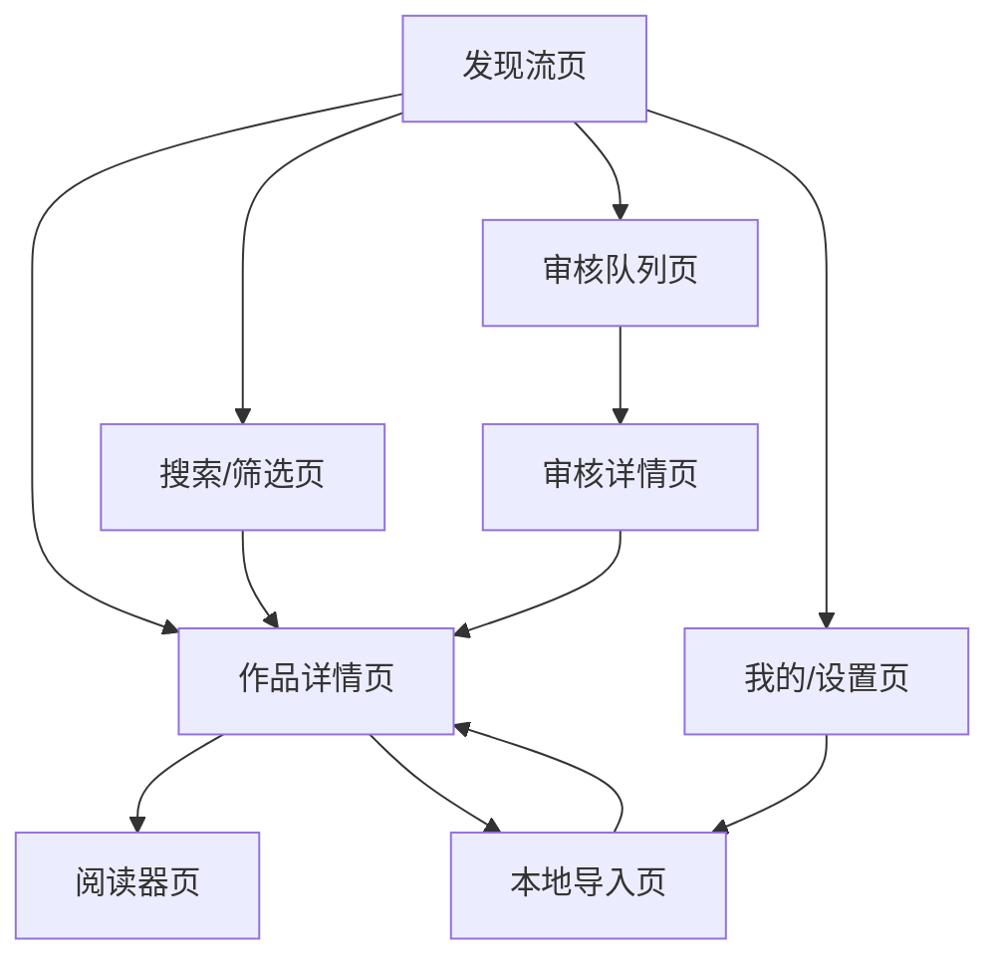
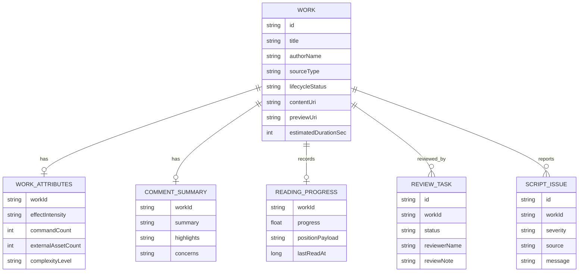

# KMD Reader Android 第二阶段执行方案

> 项目阶段：课程项目第二阶段
> 文档状态：草案
> 最近更新：2026-05-09

## 1. 阶段目标

本阶段需要把第一阶段 PRD 收束成可提交、可开发、可演示的最小范围：

- 从 PRD 中选出 3 到 5 个 MVP 功能。
- 画出页面流转图。
- 明确数据实体和 ER 关系。
- 搭建公开 Git 仓库，初始化 Android 项目、`.gitignore` 和 `README.md`。

本阶段不要求实现完整 KMD Web Runtime 接入，但项目结构应给后续接入留下位置。

## 2. MVP 功能清单

推荐第二阶段提交的 MVP 功能为 5 项：

| 编号 | 功能 | 说明 | 选择理由 |
|------|------|------|----------|
| M1 | 发现流浏览 | 用户以纵向卡片流浏览 KMD 作品，查看标题、作者、标签、短摘要和作品属性 | 体现移动端特色，不只是普通列表 |
| M2 | 作品详情查看 | 用户点击作品进入详情页，查看简介、标签、预计时长、评论摘要和开始阅读入口 | 连接浏览与阅读，是基础业务闭环 |
| M3 | KMD 阅读入口 | 用户从详情页进入阅读器页面，MVP 可先展示 WebView 占位或本地示例内容 | 保留项目核心定位：KMD 阅读 |
| M4 | 本地导入 | 用户从本地选择 `.kmd` 文件，生成本地作品记录 | 服务创作者和课程演示，工作量清晰 |
| M5 | 审核体验 | 评审志愿者查看待审核脚本、检查结果和审核结论 | 支撑“社区内容流转工具”的项目差异化 |

如果老师要求严格控制为 3 个功能，可以压缩为：

- 发现流浏览
- 作品详情与阅读入口
- 本地导入与审核体验

其中收藏、书架、设置、完整评论区、真实登录和真实上传暂不作为第二阶段 MVP。

## 3. 页面流转设计

### 3.1 页面清单

| 页面 | 作用 |
|------|------|
| 发现流页 | 默认首页，展示作品预览卡片 |
| 搜索/筛选页 | 按标题、作者、标签筛选作品 |
| 作品详情页 | 展示作品元信息、评论摘要和阅读入口 |
| 阅读器页 | 承载 KMD 阅读 Runtime，MVP 可先做占位 |
| 本地导入页 | 选择 `.kmd` 文件并生成本地作品 |
| 审核队列页 | 展示待审核作品 |
| 审核详情页 | 展示脚本检查结果、预览和审核结论 |
| 我的/设置页 | 展示设置入口和项目说明，第二阶段可简化 |

### 3.2 页面跳转图



### 3.3 底部导航建议

第二阶段建议使用 3 个主 Tab：

- `发现`：发现流、搜索、作品详情入口。
- `审核`：待审核队列和审核详情。
- `我的`：本地导入、设置和项目说明。

阅读器页、作品详情页、搜索页和审核详情页作为二级页面，不放在底部导航中。

## 4. 数据实体设计

第一阶段 PRD 已经定义了核心实体。第二阶段为了降低实现复杂度，可以先保留以下实体：

| 实体 | 说明 |
|------|------|
| Work | 作品，是发现、详情、阅读、导入和审核的中心实体 |
| WorkAttributes | 作品属性，用于展示动态效果强度、资源依赖和复杂度 |
| CommentSummary | 评论摘要，用于发现流和详情页展示 |
| ReadingProgress | 阅读进度，用于后续继续阅读 |
| ReviewTask | 审核任务，用于评审志愿者工作台 |
| ScriptIssue | 脚本检查问题，用于审核详情页 |

第二阶段可以暂不落库 `Favorite` 和 `ReaderSettings`，除非实现进度很顺。

### 4.1 实体字段

#### Work

| 字段 | 类型 | 说明 |
|------|------|------|
| id | String | 作品 ID |
| title | String | 标题 |
| authorName | String | 作者名 |
| description | String | 简介 |
| coverUri | String | 封面路径 |
| tags | List<String> | 标签 |
| category | String | 分类 |
| sourceType | String | `mock` / `local` / `remote` |
| lifecycleStatus | String | `draft` / `submitted` / `published` / `needs_changes` / `rejected` |
| contentUri | String | KMD 内容路径 |
| previewUri | String | 预览资源路径 |
| estimatedDurationSec | Int | 预计阅读/播放时长 |
| createdAt | Long | 创建时间 |
| updatedAt | Long | 更新时间 |

#### WorkAttributes

| 字段 | 类型 | 说明 |
|------|------|------|
| workId | String | 作品 ID |
| effectIntensity | String | 动态效果强度 |
| commandCount | Int | 指令数量 |
| externalAssetCount | Int | 外部资源数量 |
| complexityLevel | String | 复杂度等级 |
| runtimeVersion | String | Runtime 版本 |

#### CommentSummary

| 字段 | 类型 | 说明 |
|------|------|------|
| workId | String | 作品 ID |
| summary | String | 评论摘要 |
| highlights | List<String> | 亮点 |
| concerns | List<String> | 疑问或争议 |
| updatedAt | Long | 更新时间 |

#### ReadingProgress

| 字段 | 类型 | 说明 |
|------|------|------|
| workId | String | 作品 ID |
| progress | Float | 阅读进度 |
| positionPayload | String | Runtime 位置状态 |
| lastReadAt | Long | 最近阅读时间 |

#### ReviewTask

| 字段 | 类型 | 说明 |
|------|------|------|
| id | String | 审核任务 ID |
| workId | String | 作品 ID |
| status | String | `pending` / `approved` / `needs_changes` / `rejected` |
| reviewerName | String | 评审志愿者名称 |
| reviewNote | String | 审核备注 |
| submittedAt | Long | 提交时间 |
| reviewedAt | Long | 审核时间 |

#### ScriptIssue

| 字段 | 类型 | 说明 |
|------|------|------|
| id | String | 问题 ID |
| workId | String | 作品 ID |
| severity | String | `info` / `warning` / `error` |
| source | String | `parser` / `layout` / `effect` / `asset` / `performance` |
| location | String | 问题位置 |
| message | String | 问题说明 |
| suggestion | String | 修改建议 |

### 4.2 ER 关系图



## 5. 原型工具选择

老师推荐墨刀，说明课程接受低门槛页面原型。Figma 更适合训练长期设计能力，尤其是组件化、设计系统、Auto Layout 和移动端交互规范。

建议策略：

- 课程提交：用 Figma 画页面，并导出页面流转图截图提交。
- 如果老师强制使用墨刀：把 Figma 设计导出为图片，再在墨刀里串联热点。
- 如果时间紧：直接在 Android Compose 中搭 UI 页面，用应用截图作为页面设计材料。

推荐优先级：

1. Figma：训练设计能力，适合长期维护。
2. Android Compose 原型：最快进入真实项目，适合代码驱动。
3. 墨刀：适合课程流程，但长期价值略低。

## 6. Git 仓库与项目结构

### 6.1 推荐仓库策略

长期维护建议采用“主项目内孵化 + 课程仓库公开提交”的双层策略：

- KMD 主仓库继续保存 PRD、架构文档、KMD Runtime 和长期演进记录。
- 课程要求的公开 Git 仓库单独创建，例如 `kmd-reader-android`。
- 公开仓库中只放 Android 应用和必要文档，不复制整个 KMD 编辑器源码。

这样可以避免课程仓库过大，也避免把 KMD 核心复制成第二份来源。

### 6.2 公开仓库建议结构

```text
kmd-reader-android/
  app/
  docs/
    prd/
      kmd-reader-android-prd.md
      kmd-reader-android-stage-2-plan.md
  reader-runtime/
    README.md
  .gitignore
  README.md
  settings.gradle.kts
  build.gradle.kts
```

`reader-runtime/` 只放说明或后续构建产物，不直接维护第二份 KMD 核心源码。

仓库名保留 `kmd-` 前缀，表示它属于 KMD 生态；仓库内部目录不再重复 `kmd-` 前缀。

### 6.3 初始化流程

推荐操作：

1. 在 GitHub 新建公开仓库 `kmd-reader-android`。
2. 本地用 Android Studio 创建新项目。
3. 选择 `Empty Activity` 或 `Empty Compose Activity`。
4. 语言选择 Kotlin。
5. UI 选择 Jetpack Compose。
6. Minimum SDK 建议 26 或 28。
7. 初始化 `main` 分支。
8. 添加 `.gitignore`、`README.md` 和 `docs/`。
9. 首次提交：`init android project and docs`。
10. 推送到公开 GitHub 仓库。

### 6.4 README 最小内容

```markdown
# KMD Reader Android

KMD Reader Android 是一个面向 KMD 创作内容的移动端阅读与社区浏览应用。

项目目标：

- 浏览 KMD 作品预览流
- 查看作品详情和属性
- 打开 KMD 阅读器
- 导入本地 `.kmd` 文件
- 提供评审志愿者审核体验

本项目为 Android 课程项目，同时也是 KMD 内容生态移动端宿主的原型。
```

## 7. 第二阶段提交材料

可以直接提交以下内容：

- Git 仓库链接：公开 GitHub 仓库地址。
- MVP 功能清单：使用本文第 2 节。
- 页面跳转图：使用本文第 3.2 节 Mermaid 图，或在 Figma/墨刀中重画后截图。
- 数据实体和 ER 图：使用本文第 4 节。

## 8. 下一步建议

第二阶段完成后，建议进入两个并行方向：

- 设计方向：用 Figma 画发现流页、作品详情页、阅读器页、审核队列页、审核详情页。
- 工程方向：初始化 Android Compose 项目，先用本地 mock 数据跑通页面导航和列表展示。
